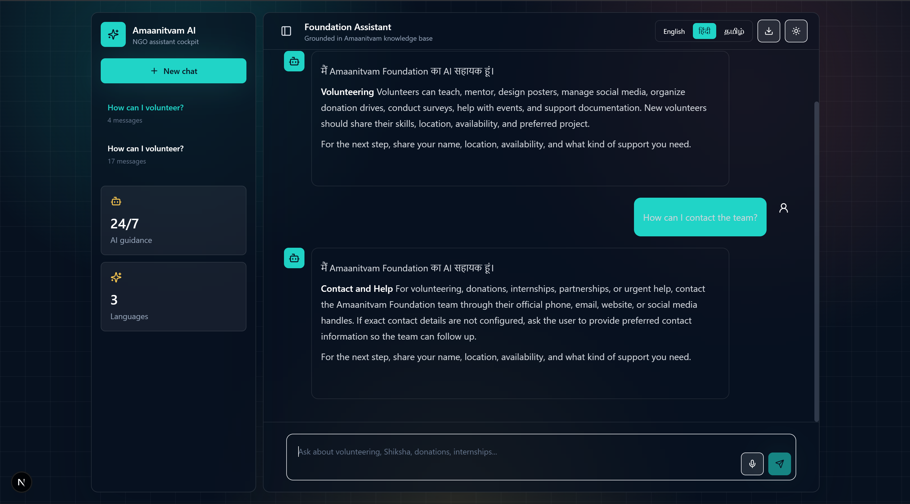

# AI Chatbot for NGO Website 🤖

An AI-powered chatbot designed for NGO websites to provide instant support and improve user engagement. The chatbot helps visitors with donation details, volunteer registration, FAQs, campaigns, event information, and NGO services through real-time conversations.

---

# 🚀 Features

* 💬 Real-time AI chatbot support
* 🙋 Volunteer registration assistance
* 💰 Donation guidance and support
* ❓ Automated FAQ responses
* 🌐 User-friendly chatbot interface
* ⏰ 24/7 automated assistance
* 🧠 Smart conversational responses using AI
* 📱 Responsive design for mobile and desktop

---

# 🛠️ Tech Stack

## Frontend

* HTML
* CSS
* JavaScript
* React (if used)

## Backend

* Node.js
* Express.js

## AI Integration

* OpenAI API / NLP Models

## Database

* MongoDB / Firebase

---

# 📂 Project Structure

```bash
AI-Chatbot-for-NGO-Website/
│
├── screenshots/
├── src/
├── public/
├── README.md
├── package.json
└── LICENSE
```

---

# 📸 Screenshots

## Home Page

Add your screenshot inside:

```bash
screenshots/home.png
```

Then replace this text with:

```md

```

---

# ⚙️ Installation

## Clone Repository

```bash
git clone https://github.com/The-inspiringHarsh/AI-Chatbot-for-NGO-Website.git
```

## Open Project Folder

```bash
cd AI-Chatbot-for-NGO-Website
```

## Install Dependencies

```bash
npm install
```

## Run Project

```bash
npm start
```

---

# 🎯 Purpose of the Project

This project aims to help NGOs improve communication and user interaction by providing automated AI-based assistance for visitors, donors, volunteers, and beneficiaries.

---

# 🔮 Future Enhancements

* 🌍 Multilingual chatbot support
* 🎙️ Voice assistant integration
* 📊 Donation analytics dashboard
* 😊 Sentiment analysis
* 📅 Event management integration
* 🤝 Personalized recommendations
* 📧 Email and WhatsApp integration

---

# 👨‍💻 Author

Harsh Gupta

GitHub: [https://github.com/The-inspiringHarsh](https://github.com/The-inspiringHarsh)

---

# 📜 License

This project is licensed under the MIT License.
